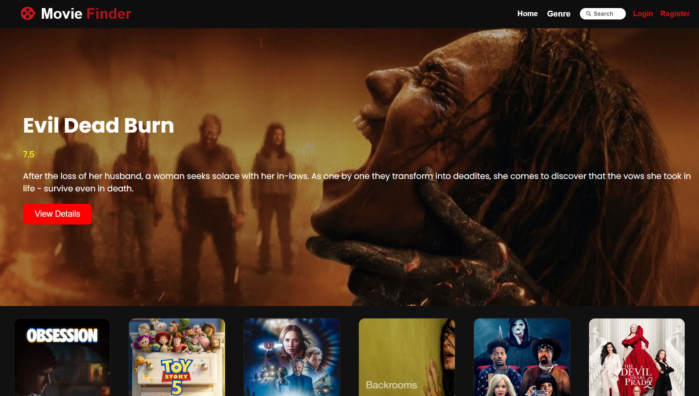
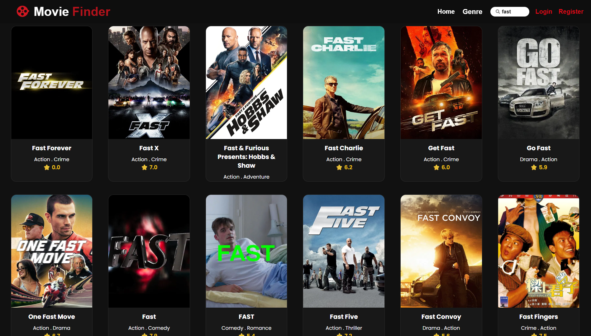

# 🎬 Movie Finder

A full-stack movie discovery web application where users can search for movies, view details, and save titles to their favorites and watchlist.
Built with the MERN stack (React + Node/Express + MongoDB) and powered by the TMDB API.

## ✨ Features

- 🔍 Search for movies by title using the TMDB API
- 📄 View detailed movie information (overview, rating, release date, poster, watch trailer, etc.)
- 🔐 User authentication (Register / log in / log out)
- ❤️ Add movies to a personal Favorites list
- 🎞️ Add movies to a Watchlist

## 🛠️ Tech Stack

**Frontend**
- React (Vite)
- CSS

**Backend**
- Node.js
- Express.js
- MongoDB (Mongoose)
- JWT for authentication

**External API**
- [TMDB (The Movie Database) API](https://www.themoviedb.org/documentation/api)

## Deployment
- Vercel (Frontend)
- Render (Backend)

## 📂 Project Structure

```
Movie-Finder/
├── Client/           # React (Vite) frontend
│   ├── src/
│   ├── public/
│   └── package.json
├── Server/           # Node/Express backend
│   ├── routes/
│   ├── controllers/
│   ├── models/
│   ├── middleware/
│   └── package.json
├── screenshots/
└── README.md                                
```

## 🚀 Getting Started

### Prerequisites
- Node.js
- MongoDB Atlas
- A free [TMDB API key](https://www.themoviedb.org/settings/api)

### 1. Clone the repository
```bash
git clone https://github.com/alanbabu518-spec/Movie-Finder.git
cd Movie-Finder
```

### 2. Set up the backend
```bash
cd Server
npm install
```

Start the server:
```bash
npm run dev
```

### 3. Set up the frontend
```bash
cd Client
npm install
```

Start the frontend:
```bash
npm run dev
```

The app is now running at `http://localhost:5173`.

## 🌐 Live Demo

[movie-finder live demo](https://movie-finder-chi-ochre.vercel.app/)

## 📸 Screenshots

### 🏠 Home Page


### 🔍 Search


### 🎬 Movie Details


### ❤️ Favorites


### 🎞️ Watchlist

 


## Future Improvements

- 🌙 Add Dark/Light Mode
- 🤖 AI-powered Movie Recommendations
- 📺 TV Shows and Web Series Support
- 📈 Advanced Search and Filtering

## 👤 Author

**Alan Babu**

[GitHub]: https://github.com/alanbabu518-spec
